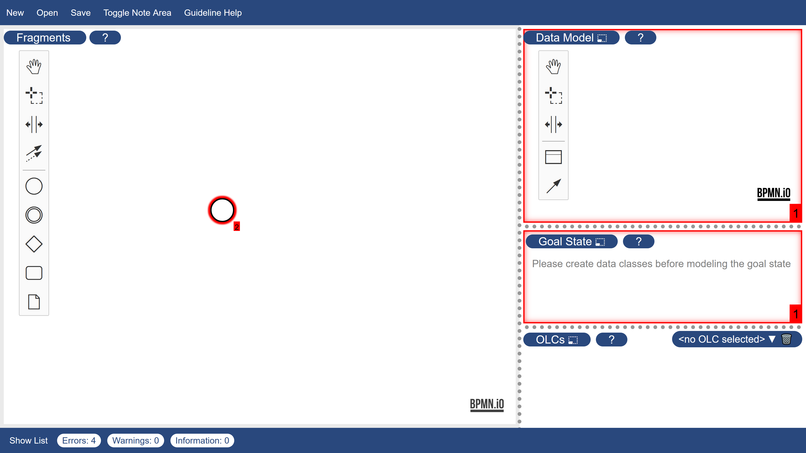
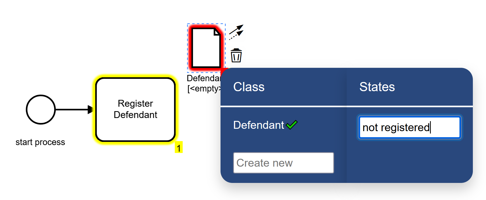
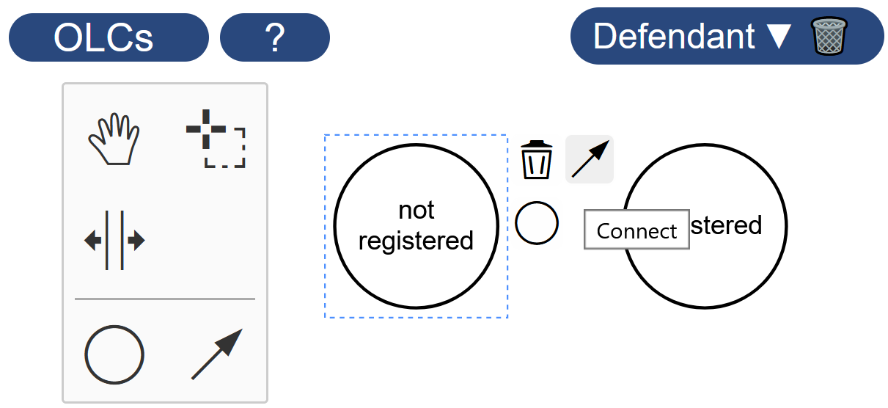
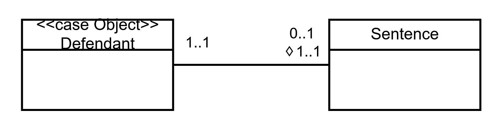
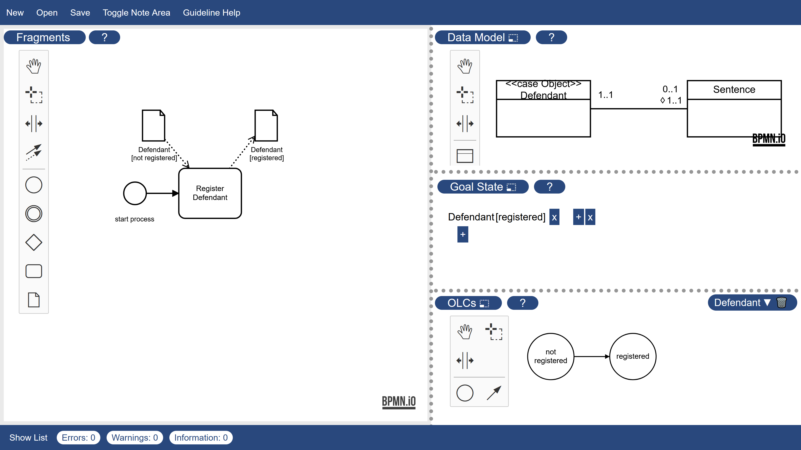
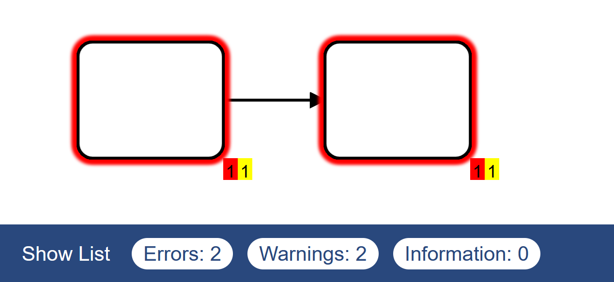
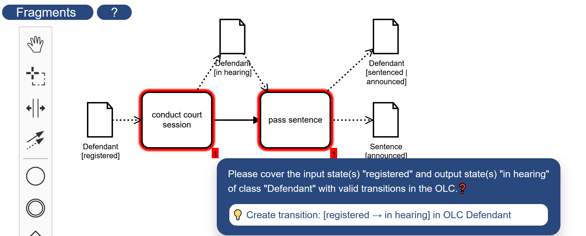

# Tutorial
This is a short tutorial document to showcase the usage of fcm-js with an example. A video version of this tutorial can be found at TBD.

<!-- TBD how to talk about suitability checking, because it is not the first screen to be shown. -->

<!-- Screenshot of empty tool only with start event, maybe already with the context menu of the start event? -->
When you first open the tool, you see the four diagram modelers, one for each diagram type of fcm models.

   

The modelers are separated by dotted lines, which can be dragged to change the spacing. One modeler is "in focus" on the left side of the screen, while the other three share the right side. Another modeler can be put into focus by clicking on its title.

 Let's model a simple court process from scratch. 

## Basic Modeling
We start by naming the pre-existing start event. We can do this by double-clicking the element, typing the name "start process", and confirming with enter or simply by left-clicking on the canvas. We then create a first activity. New elements can be created by either drag-and-dropping them from the palette on the left side, or by selecting an element and using its context menu. We then name the activity "Register Defendant", as we did with the start event. If not already done, we connect the start event to the activity, either by using the global connect tool from the palette and clicking on both elements, or by using the context menu of the start event. 
<!-- Screenshot of tool with the activity, maybe label the connect tool? -->

We add data pre- and postconditions to this activity by creating two data object references and connecting them to the activity.
When creating a data object reference, a menu opens that demands so select a data class and states. New classes and corresponding states can be created by filling in the respective fields and confirming. We create a data class "Defendant" and a state "not registered" with the input data object, and another state "registered" of the same class with the output data object. Note that the data class and the states are now also shown in the respective modelers on the right-hand side. 
<!-- Screenshot for state after creating the data conditions -->

 Let's quickly explore the other modelers.

We now head to the OLC modeler to create the transition between the states "not registered" and "registered", which happens in the activity. This is done as shown before, with the arrow-shaped create transition tool of the OLC modeler palette or the context menu of the source state. Likewise, new states can be created by drag-and-dropping from the palette or using the context menu of an existing state.
<!-- Screenshot with highlighted connection -->

  
In the data modeler, we designate "Defendant" as case class by using the c-shaped entry of its context menu. We also create another class "Sentence" which we know that we will need later. We connect them with the associate classes palette tool, or the corresponding context menu entry. Let's edit the cardinality constraints, by double-clicking them as if they were labels. For class "Defendant" we set them to "1..1". Because we did not specify (diverging) goal cardinality constraints, those are set to the same value and hidden. For class "Sentence", we set them to "0..1⬨1..1", so to runtime constraints of "0..1" and goal constraints of "1..1". 
<!-- Screenshot with state after adding the second class -->

Lastly, let's head to the goal state modeler. We create a new conjunction by clicking on the plus symbol. This automatically creates a first literal in the conjunction. We set the data class and states of the literal to "Defendant" and "registered" by hovering over its text and selecting them in the appearing menus.

We now have a valid minimal model:
<!-- Screenshot with state after editing the goal state -->

   

## Guideline-supported Modeling
We have now explored the basic modeling features of fcm-js. One central feature of fcm-js is integrated guideline checking.

Let's create two more activities in the fragment model and connect them to each other, but leave out their names. We notice several things:
The activities are marked in red, which indicates that they are erronous, and they have red and yellow markers labeled "1" at their bottom right, which indicate that each has one error and one warning respectively. Furthermore, the bottom bar displays "Errors: 2" and "Warnings: 2" which are the total number or errors and warnings in the model. Errors are guideline violations that always indicate invalid models, while warnings are violations that might indicate invalidity.

We can inspect the concrete violations in two ways: Firstly, we can expand the total violation list, by clicking on "Show list" in the bottom bar. This gives an overview over all violations and allows to jump to affected elements by double-clicking list entries.<!-- Screenshot with table opened, erroneous activities still visible -->
Secondly, we can directly click on the violation markers to get a list of violations of the respective severity for the respective element.
<!-- Screenshot with table closed(?), list on element opened -->

In our concrete example, the error says "Please provide a label for each fragment element.". We can find out more about why this is an error by clicking on the "❓" symbol, which links to the respective guideline F11. We fix this error by giving the two activities labels, "conduct court session" and "pass sentence". 

The activities are now marked in yellow, indicating that their highest violation severity is warning. Clicking on the violation markers reveals that we should "[c]onsider using a data object to model a pre- and postcondition for this activity". Accordingly, we create the following data object references: "Defendant [registered]" as input to "conduct court session", "Defendant [in hearing]" as output to "conduct court session" and input to "pass sentence", and "Defendant [innocent | sentenced] and "Sentence [announced]" as outputs to "conduct court session".

Now the warnings have been fixed, but new errors arose. Clicking the violation markers reveals that the state transitions for "Defendant" induced by the new activities are not covered by the respective OLC. We could fix this by manually creating the transitions as done in the basic modeling section. Instead, we utilize the quick fixes displayed under the violation message, which are marked with a "💡" symbol. We apply the quick fixes by clicking on them. This automatically creates the missing transitions and fixes the errors, while we can still focus on the fragments.

 With the new states, we also adapt the goal condition to "Sentence [announced] ∧ Defendant [sentenced | innocent]".
<!-- Screenshot with final state, maybe even table open to highlight that there are no violations anymore -->

## File-in and -out
With our model finished for now, we want to write it to file for later editing. We do this by clicking the "Save" button in the top bar, which downloads the model as .zip file. The next time we open fcm-js we can then use the "Open" button in the top bar to reimport the model.

You can download the model we created now [here](./tutorial_model.zip)

<!-- 
* Soll das Dokument mehr use-case- oder mehr tutorial-bezogen sein? MK: Denke das ist super so! Müsste alles drin sein.
* Screenshots!!!
 -->
